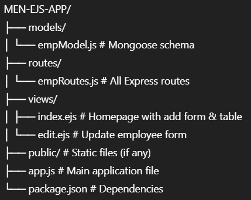

# 👨‍💼 MEN-EJS-APP

A basic **Employee Management** CRUD app built using the **MEN Stack**:

- **M**ongoDB (Database)
- **E**xpress (Backend framework)
- **N**ode.js (Runtime)
- **EJS** (Templating engine)

---

## ✨ Features

- 📝 Add new employees
- 📋 View employee list
- ✏️ Update employee details
- ❌ Delete employees
- 🎨 Clean UI using Bootstrap 5
- 📦 Uses `method-override` to support HTTP `PATCH` and `DELETE` from HTML forms

---

## 📂 Project Structure



---

## 🚀 Getting Started

### 1. Clone the repository

```bash
git clone https://github.com/your-username/MEN-EJS-APP.git
cd MEN-EJS-APP
npm init
npm i ejs express mongoose nodemon
nodemon app.js


http://localhost:4000
```
